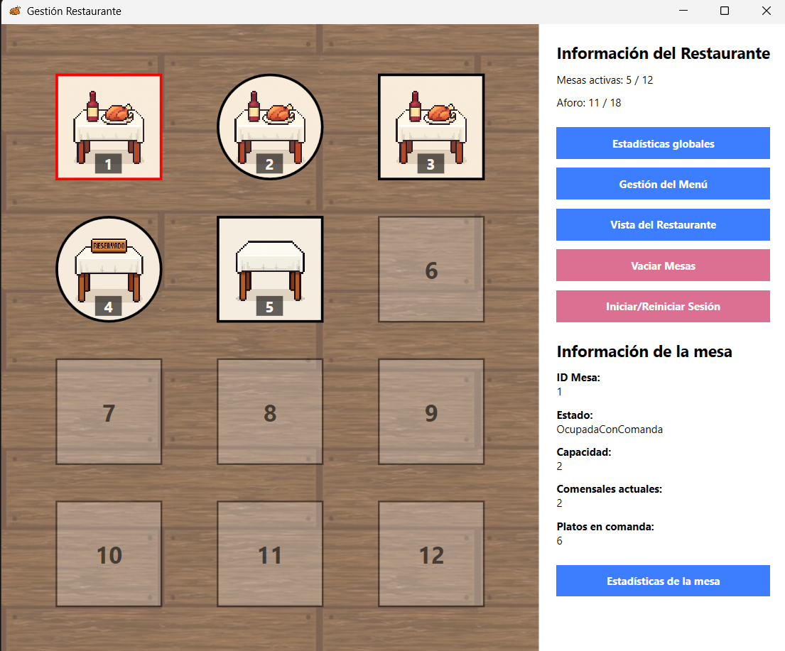
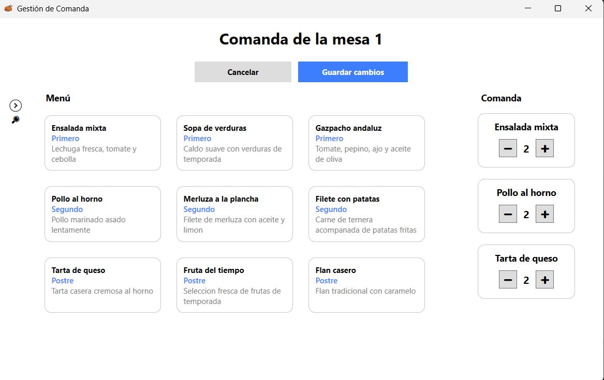
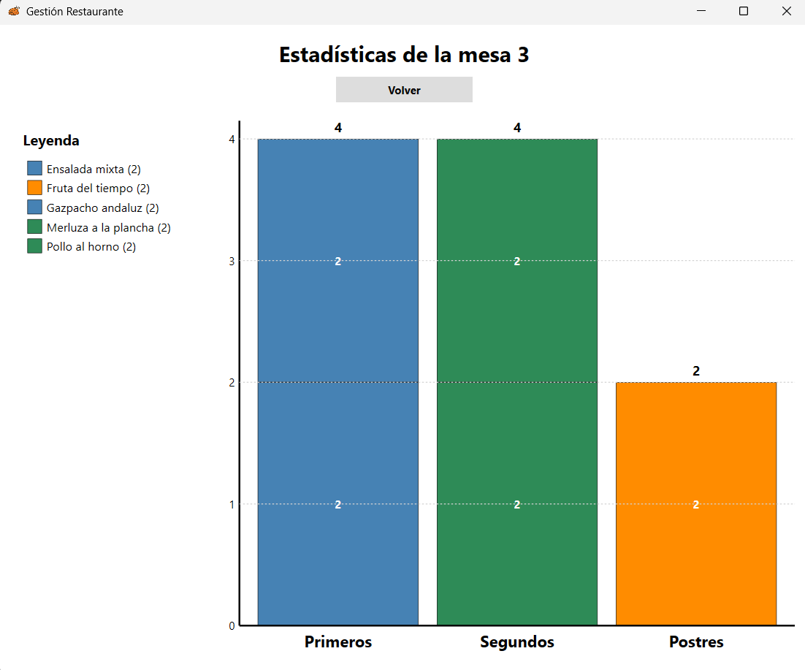
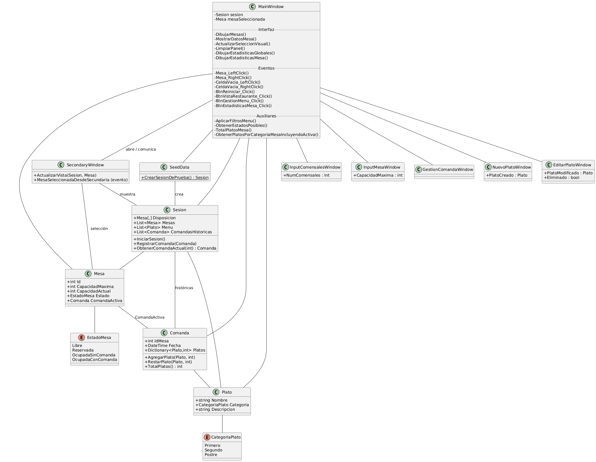

# Gestión de restaurante (WPF)

Aplicación de escritorio para gestionar la sala de un restaurante: los camareros ven el plano de mesas, cambian su estado, anotan comensales y comandas, y generan el ticket al cerrar cada mesa. Incluye gestión del menú y estadísticas de consumo.

Desarrollada en C# y XAML con WPF (.NET Framework 4.7.2) como práctica final de la asignatura Interfaces Gráficas de Usuario del Grado en Ingeniería Informática (Universidad de Salamanca), en noviembre de 2025.

<!--
CAPTURAS: guarda tres capturas en docs/capturas/ con estos nombres y quita este comentario.




-->

## Funcionalidades

**Sala**

- Plano de 4 × 3 posiciones dibujado sobre un `Canvas` que se redimensiona con la ventana.
- Alta y baja de mesas con el botón derecho sobre una celda, indicando su capacidad.
- Cada mesa cambia de imagen según su estado y se selecciona con un clic.

**Estados de mesa**

Una mesa solo puede pasar a los estados permitidos desde el actual:

| Estado actual | Puede pasar a |
| --- | --- |
| Libre | Reservada, Ocupada sin comanda |
| Reservada | Libre, Ocupada sin comanda |
| Ocupada sin comanda | Libre, Ocupada con comanda |
| Ocupada con comanda | Libre |

La aplicación mantiene las reglas entre estado, comensales y comanda. Por ejemplo, no se abre una comanda en una mesa sin comensales, y una comanda que se queda sin platos devuelve la mesa a "Ocupada sin comanda".

**Comandas y tickets**

- Ventana de edición con el menú a un lado y la comanda al otro; los platos se añaden y quitan con botones o doble clic.
- Aviso al cerrar con cambios sin guardar, con opción de descartarlos y recuperar la comanda anterior.
- Al finalizar una comanda se genera un ticket en texto, la comanda pasa al histórico y la mesa queda libre.

**Menú**

- Carga del menú desde un fichero de texto al arrancar; si no se elige ninguno, se usa un menú por defecto.
- Alta, edición y borrado de platos.
- Buscador por texto y por categoría (primero, segundo, postre).

**Estadísticas**

Los dos gráficos están dibujados a mano sobre `Canvas`, sin librerías de gráficos:

- Globales: total de platos servidos por mesa, incluyendo las mesas ya eliminadas que tienen histórico.
- Por mesa: columnas apiladas por categoría, con un color por plato y leyenda.

**Vista del restaurante**

Ventana secundaria no modal con el listado de mesas y los platos de la mesa seleccionada. La selección está sincronizada en los dos sentidos con la ventana principal mediante `INotifyPropertyChanged`.

## Cómo ejecutarlo

Requisitos: Windows y Visual Studio 2022 con la carga de trabajo "Desarrollo de escritorio de .NET" (.NET Framework 4.7.2).

1. Clona el repositorio:
   ```
   git clone https://github.com/oscar-dom/TrabajoIGU.git
   ```
2. Abre `TrabajoIGU/TrabajoIGU.sln` en Visual Studio.
3. Compila y ejecuta con F5. Visual Studio restaura el paquete NuGet (Extended WPF Toolkit) en la primera compilación.

Al arrancar, la aplicación pide un fichero de menú. Puedes elegir `TrabajoIGU/Data/menu.txt` o cancelar para usar el menú por defecto. La sesión empieza con cinco mesas de prueba ya colocadas.

### Formato del fichero de menú

Un plato por línea, con los campos separados por `|`. Las líneas vacías y las que empiezan por `#` se ignoran.

```
# nombre | categoria | descripcion
Ensalada mixta|Primero|Lechuga fresca, tomate y cebolla
Pollo al horno|Segundo|Pollo marinado asado lentamente
Tarta de queso|Postre|Tarta casera cremosa al horno
```

## Uso

| Acción | Resultado |
| --- | --- |
| Clic izquierdo en una mesa | La selecciona y muestra sus datos en el panel lateral |
| Clic derecho en una mesa | Menú para cambiar estado, editar comensales, editar o finalizar la comanda y eliminar la mesa |
| Clic derecho en una celda vacía | Añade una mesa |
| Clic izquierdo en una celda vacía | Quita la selección |
| Doble clic en un plato (gestión del menú) | Edita o elimina el plato |

El panel lateral da acceso a las estadísticas, la gestión del menú, la vista del restaurante, el vaciado de mesas y el reinicio de la sesión.

## Estructura del proyecto

```
TrabajoIGU/
├── Models/                  Modelo de datos
│   ├── Sesion.cs            Disposición de la sala, mesas, menú e histórico
│   ├── Mesa.cs              Mesa y enumerado de estados
│   ├── Comanda.cs           Platos pedidos y cantidades
│   └── Plato.cs             Plato y enumerado de categorías
├── Data/
│   ├── SeedData.cs          Sesión de prueba y carga del menú
│   └── menu.txt             Menú de ejemplo
├── Windows/                 Ventanas secundarias y diálogos
├── MainWindow.xaml(.cs)     Ventana principal: sala, menú y estadísticas
├── Imagenes/                Recursos gráficos
├── Diagrama.png             Diagrama de clases
└── TrabajoIGU.pdf           Memoria de la práctica
```



La memoria (`TrabajoIGU/TrabajoIGU.pdf`) recoge el planteamiento, la planificación por fases, el manual de usuario y el manual del programador.

## Limitaciones y mejoras pendientes

- **Sin persistencia.** El estado de la sala y el histórico se pierden al cerrar la aplicación. El siguiente paso sería guardarlos en JSON o SQLite.
- **Lógica en el code-behind.** `MainWindow.xaml.cs` concentra dibujo, eventos y reglas de negocio. Una refactorización a MVVM separaría la lógica de la interfaz y permitiría probarla.
- **Tickets sin importes.** Los platos no tienen precio, así que el ticket lista cantidades y no totales.
- **Sin pruebas automáticas.** Las reglas de transición de estados son el primer candidato a tener tests unitarios.
- **Sala de tamaño fijo.** El plano es de 4 × 3 posiciones, definido como constante en `Sesion`.

## Autor

Óscar Domínguez Álvarez
